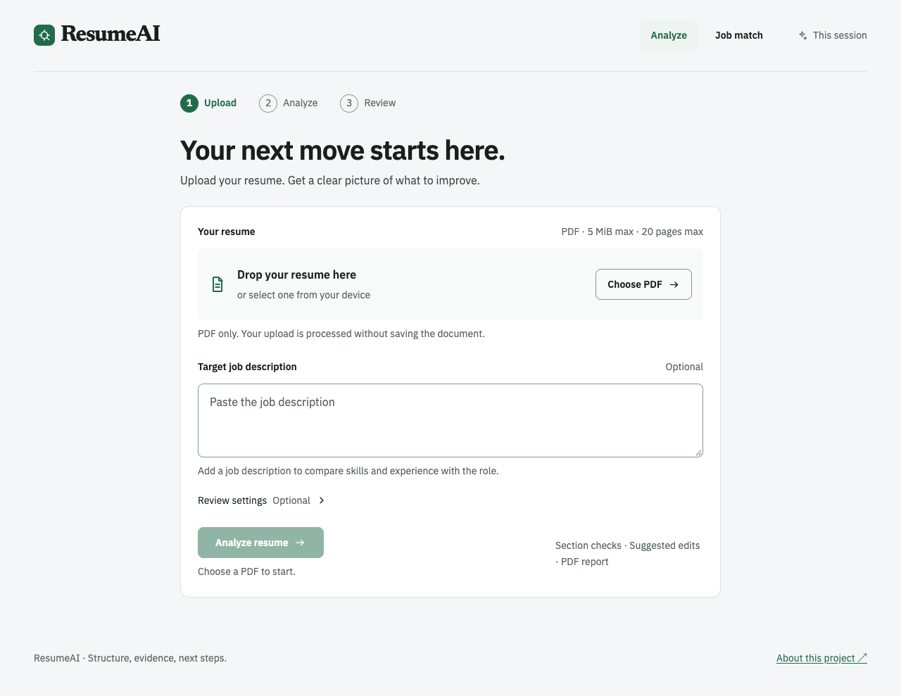
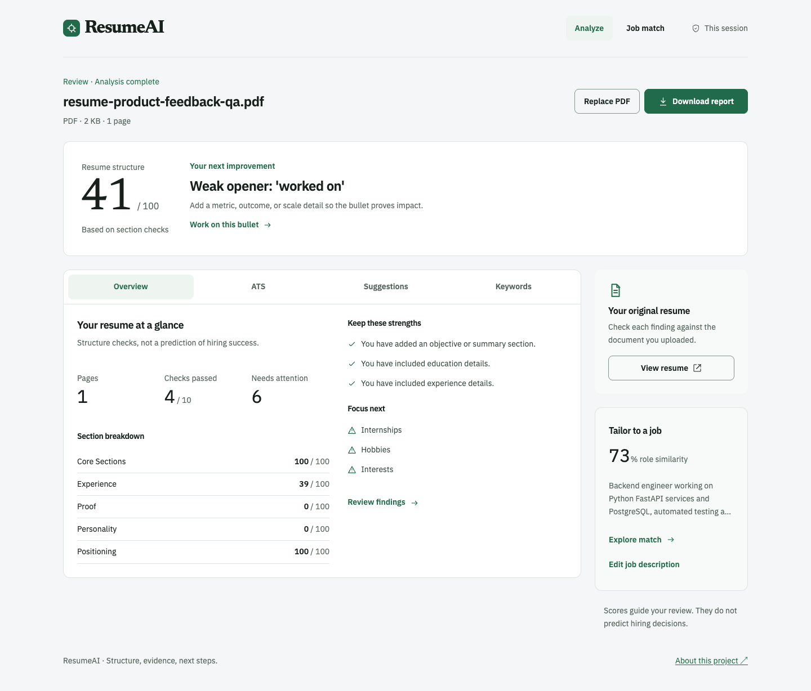
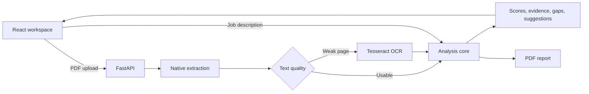

# cvLens

[](https://www.python.org/)
[](https://react.dev/)
[](https://fastapi.tiangolo.com/)
[](https://github.com/rammohanrediee/cvlens/actions/workflows/tests.yml)
[](LICENSE)

cvLens is a responsive resume review workspace built with React and FastAPI. It extracts text from PDF resumes, checks document structure and bullet quality, compares resume evidence with a pasted job description, and generates a downloadable report.

Scores and suggestions are decision support. They do not reproduce a specific employer's applicant tracking system or guarantee an interview.

## Product preview

### Resume upload



### Analysis workspace



## What it does

- Accepts PDF resumes up to 5 MiB and 20 pages.
- Uses native PDF text when available and Tesseract OCR for weak or image-only pages.
- Detects contact details, education, skills, experience, projects, achievements, and certifications.
- Scores resume structure and groups ATS checks into passed and needs-attention sections.
- Reviews weak bullet openings, missing metrics, and short evidence statements.
- Compares a resume with a pasted job description using deterministic matching and optional embeddings.
- Maps requirements to supporting resume lines and identifies missing skills, tools, domain terms, and evidence.
- Supports editable local suggestion drafts, copying, skip and undo, and a full-screen mobile editor.
- Generates a downloadable PDF analysis report.

## Technology

| Layer | Technology |
|---|---|
| Web client | React 19, Vite 7, JavaScript, CSS design tokens |
| API | FastAPI, Uvicorn, Pydantic |
| Resume analysis | Python, scikit-learn, deterministic parsers |
| PDF extraction | PyMuPDF, pdfminer.six, Tesseract OCR |
| PDF reports | ReportLab with a built-in fallback writer |
| Automation | GitHub Actions, Ruff, Coverage, pip-audit, Docker |

## Architecture

```text
.
├── backend/app/
│   ├── api/                 # FastAPI routes and request boundary
│   ├── core/                # Parsing, scoring, matching, and report generation
│   ├── models/              # Domain records
│   ├── schemas/             # Request and response models
│   └── services/            # Analysis and PDF extraction use cases
├── web/
│   ├── src/components/      # Upload, navigation, and result views
│   ├── src/api.js           # Browser API client
│   ├── src/App.jsx          # Product workflow and state
│   └── vite.config.js       # Local API proxy
├── tests/                   # Python unit, API, OCR, and architecture checks
├── images/                  # README product screenshots
├── requirements/            # Development and optional semantic dependencies
├── Dockerfile               # FastAPI container
└── .github/workflows/       # Python, web, and container checks
```



The browser uses Vite's `/api` proxy during local development. The API performs extraction and analysis and returns structured JSON; the React workspace owns interaction state such as selected tabs and suggestion drafts.

## Getting started

### Requirements

- Python 3.11 or newer
- Node.js 22 or newer
- Tesseract 5 with English language data

On macOS:

```bash
brew install tesseract
```

### Install the API

```bash
git clone https://github.com/rammohanrediee/cvlens.git
cd cvlens

python3 -m venv .venv
source .venv/bin/activate
python -m pip install --upgrade pip
python -m pip install -r requirements.txt
```

Optional semantic matching:

```bash
python -m pip install -r requirements/semantic.txt
```

### Install the web client

```bash
cd web
npm ci
cd ..
```

## Run locally

Start FastAPI in the first terminal:

```bash
source .venv/bin/activate
python -m backend.app.main
```

Start React in the second terminal:

```bash
cd web
npm run dev
```

Open `http://127.0.0.1:5173`. The API runs at `http://127.0.0.1:8001`, and its OpenAPI documentation is available at `http://127.0.0.1:8001/docs`.

## Configuration

The backend reads process environment variables:

| Variable | Default | Purpose |
|---|---|---|
| `API_HOST` | `127.0.0.1` | API bind address |
| `PORT` | `8001` | API port |
| `RESUME_API_KEY` | empty | Requires a bearer token for POST requests when set |
| `ALLOW_UNAUTHENTICATED_POSTS` | empty | Explicitly permits anonymous POST requests on a non-loopback bind |
| `API_RATE_LIMIT_PER_MINUTE` | `60` | Per-client POST request limit |
| `HF_TOKEN` | empty | Token for optional Hugging Face model downloads |
| `OPENROUTER_API_KEY` | empty | Server-side OpenRouter key used only after the user selects enhanced AI review |
| `OPENROUTER_MODEL` | `z-ai/glm-5.3-flash` | OpenRouter model slug for grounded resume analysis |
| `OPENROUTER_SITE_URL` | empty | Optional public site URL for OpenRouter app attribution |
| `OPENROUTER_APP_TITLE` | `cvLens` | Application title sent to OpenRouter |

The web client calls the same origin by default. `web/.env.example` therefore leaves the API base URL empty:

```env
VITE_API_BASE_URL=
```

During local development, Vite proxies `/api` to port 8001. Production should route the same path to FastAPI through the site's reverse proxy.

Keyless POST requests are allowed automatically only on loopback. A public bind must either set `RESUME_API_KEY` or explicitly set `ALLOW_UNAUTHENTICATED_POSTS=true`. For an authenticated same-origin web deployment, keep the backend private and configure the trusted reverse proxy to discard client-supplied `Authorization` headers before injecting the backend bearer token. Never place `RESUME_API_KEY` in a `VITE_*` variable because browser bundles are public.

Use `python -m backend.app.main` as the supported launcher so the effective bind host is validated. ASGI factory deployments must set `RESUME_API_KEY` or `ALLOW_UNAUTHENTICATED_POSTS=true` because the factory cannot safely infer a server CLI `--host` override.

The in-process rate limiter is a final circuit breaker keyed to the immediate network peer. A production reverse proxy or API gateway must enforce authoritative client-aware rate, concurrency, body-size, and timeout limits; multi-replica deployments should not treat the process-local limiter as a global quota.

### Enhanced AI review

Set the OpenRouter key in the backend process environment; never place it in a `VITE_*` variable or browser storage:

```bash
export OPENROUTER_API_KEY="your-key"
export OPENROUTER_MODEL="z-ai/glm-5.3-flash"
python -m backend.app.main
```

Enhanced review is opt-in in the upload form. When selected, the backend removes email addresses, phone numbers, and URLs, limits the submitted text, then sends the resume text, job description, and extracted bullets to OpenRouter. Provider output must satisfy a strict JSON schema, quote evidence from an exact resume line, reference a real extracted bullet, and introduce no new numeric claim. Invalid or unavailable AI output is discarded and the deterministic review remains visible.

## API

| Method | Endpoint | Description |
|---|---|---|
| `GET` | `/api/v1/health` | Service health |
| `POST` | `/api/v1/documents/extract` | PDF text extraction and OCR |
| `POST` | `/api/v1/analyses` | Complete resume and job-description analysis |
| `POST` | `/api/v1/analyses/bullet-quality` | Bullet-quality review |
| `POST` | `/api/v1/analyses/jd-gap` | Categorized job-description gaps |
| `POST` | `/api/v1/analyses/interview-prep` | Interview-question generation |
| `POST` | `/api/v1/reports/pdf` | Downloadable PDF report |

Example health check:

```bash
curl http://127.0.0.1:8001/api/v1/health
```

## Development checks

Python checks:

```bash
python -m pip install -r requirements/dev.txt
ruff check backend tests
coverage run --source=backend.app -m unittest discover -s tests -v
coverage report -m --fail-under=80
```

React checks:

```bash
cd web
npm run lint
npm run build
```

GitHub Actions runs the Python checks, the React lint/build, a dependency audit, a Docker build, and a container health check.

## Deployment

The Docker image and `nixpacks.toml` run the FastAPI service on port 8001:

```bash
docker build -t cvlens-api .
docker run --rm -p 8001:8001 cvlens-api
```

Build the React client separately:

```bash
cd web
npm ci
npm run build
```

Deploy `web/dist/` with a static host or reverse proxy. Route `/api` to the FastAPI service so the browser and API share an origin.

## Privacy and limits

- Uploaded PDF bytes and resume text are processed for the active request and are not persisted by this repository.
- Local suggestion drafts stay in browser memory and do not modify the uploaded PDF.
- Request size, PDF size, page count, and extracted-text limits are enforced by the API.
- PDF quality depends on the source document's layout and embedded fonts.
- Keyword and embedding similarity do not prove proficiency or job readiness.
- Suggested rewrites require human review; never add unsupported claims or metrics.

## License

cvLens is available under the [MIT License](LICENSE). The upstream copyright and permission notice are retained.
