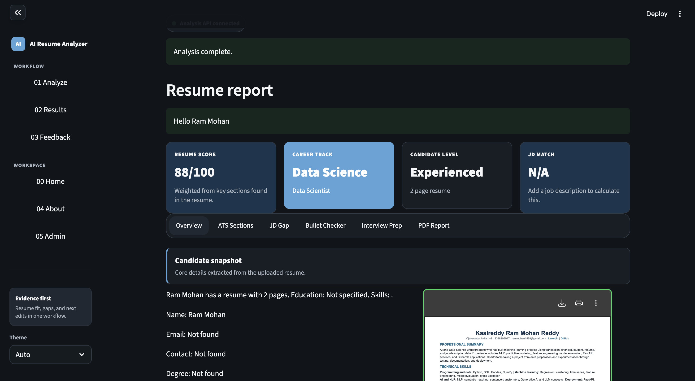
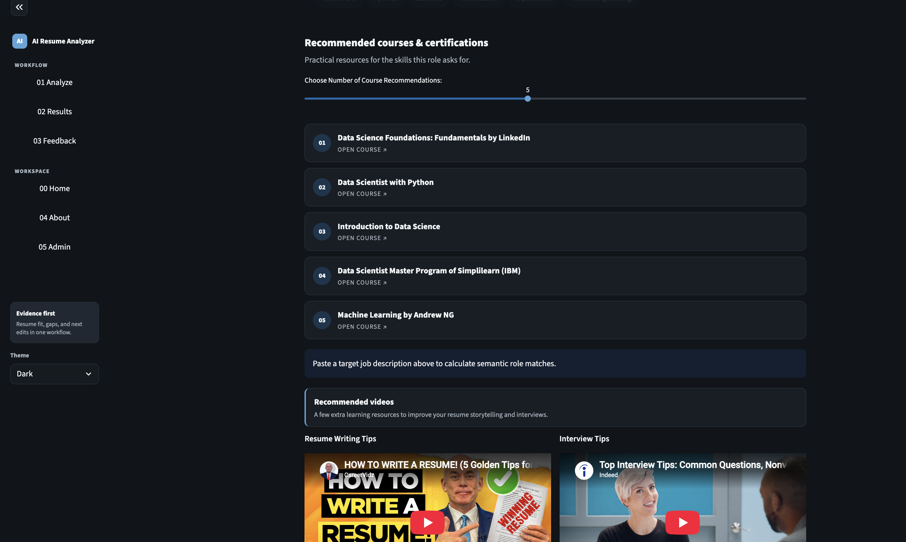
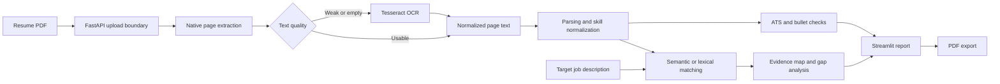
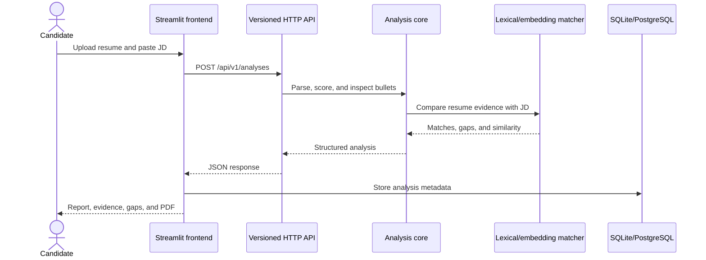

# AI Resume Analyzer

[](https://www.python.org/)
[](https://streamlit.io/)
[](LICENSE)
[](https://github.com/rammohanrediee/cvlens/actions/workflows/tests.yml)

AI Resume Analyzer is a portfolio-grade Streamlit application and FastAPI service that compares a resume with a target job description. It combines deterministic parsing, ATS-style checks, optional semantic matching, evidence-backed requirement mapping, improvement guidance, and downloadable PDF reporting.

The application is designed as a decision-support tool. Its scores and suggestions help candidates review a resume; they do not reproduce a specific employer's ATS or guarantee an interview.

## Origin and my contribution

This repository is a substantial re-architecture of
[Deepak Padhi's AI Resume Analyzer](https://github.com/deepakpadhi986/AI-Resume-Analyzer),
used under the MIT License. The upstream project supplied the original Streamlit
resume-analysis concept, course/video recommendation lists, parser foundation,
and early candidate/admin workflow. I retained its copyright and license.

My work focuses on turning that foundation into a testable, service-oriented
application. I created or rebuilt:

- a separate frontend and backend package structure;
- a hybrid PDF extraction pipeline that keeps reliable text-layer output and
  applies OCR only to weak or image-only pages;
- a versioned JSON HTTP API with health, analysis, gap, interview-prep, bullet,
  and PDF-report endpoints;
- resume-to-job evidence mapping that links prioritized requirements to
  supporting resume lines;
- deterministic skill normalization, ATS checks, bullet-quality review, and
  lexical fallbacks;
- optional semantic matching with `sentence-transformers/all-MiniLM-L6-v2`;
- SQLite and PostgreSQL persistence behind one storage interface;
- environment-based admin authentication and deployment configuration;
- downloadable PDF analysis reports;
- unit, API, architecture, and frontend-navigation tests;
- Docker, Railway-style, and continuous-integration configuration.

See [CONTRIBUTIONS.md](CONTRIBUTIONS.md) for the upstream-to-current comparison
and file-level ownership map.

## Current development

The application includes a React + Vite workspace for uploading resumes, reviewing ATS
checks, editing locally drafted suggestions, and matching a pasted job description. The
existing Streamlit interface remains available alongside the API.

## Screenshots





## Highlights

- Accepts bounded PDF uploads through FastAPI and extracts digital or scanned resumes,
  with page-level quality checks and OCR fallback.
- Parses name, contact details, education, skills, and actual PDF page count from the extracted text.
- Scores expected resume sections and groups results into readable ATS categories.
- Compares resumes with job descriptions using embeddings when available and deterministic lexical fallbacks otherwise.
- Maps prioritized JD capabilities to exact supporting resume lines and reports evidence coverage.
- Categorizes missing signals across skills, tools, domain knowledge, and evidence.
- Reviews bullet quality and suggests stronger, outcome-oriented phrasing.
- Generates technical, project, and behavioral interview-practice questions from the JD.
- Exports a PDF analysis report.
- Stores local analytics in SQLite or connects to PostgreSQL for shared deployments.
- Keeps analytics disabled by default and never persists resume files or personal identifiers.
- Exposes the analysis workflow through a versioned JSON API.

## How it works



Semantic matching uses `sentence-transformers/all-MiniLM-L6-v2` when the optional dependency is installed. If the model cannot load, the application falls back to deterministic matching so the main workflow remains available.

## Architecture

```text
.
├── app.py                         # Streamlit entry point
├── backend/app/
│   ├── api/server.py              # Versioned HTTP API
│   ├── core/                      # Parsing, matching, scoring, and reports
│   ├── models/                    # Domain and persistence models
│   ├── schemas/                   # Request and response contracts
│   └── services/                  # Analysis use cases
├── frontend/
│   ├── app.py                     # Frontend composition
│   ├── api_client.py              # Backend client
│   ├── components/                # Report and navigation UI
│   ├── pages/                     # Candidate, admin, feedback, and about pages
│   └── services/                  # PDF parsing and storage
├── tests/                         # Unit, architecture, and API integration tests
├── requirements/                  # Optional semantic and development extras
├── Dockerfile
├── nixpacks.toml
└── pyproject.toml
```

The frontend and backend are intentionally separate processes. The frontend calls the API through `BACKEND_API_URL`, which defaults to `http://127.0.0.1:8001`.

### Request flow



### Module responsibilities

| Area | Responsibility |
|---|---|
| `backend/app/core` | Parsing, normalization, scoring, matching, evidence mapping, interview prompts, and PDF generation |
| `backend/app/api` | HTTP routing, input validation, error contracts, and response serialization |
| `backend/app/services` | Application-level analysis use cases |
| `frontend/pages` | Candidate, results, admin, feedback, home, and about views |
| `frontend/components` | Navigation, report rendering, styles, courses, and admin analytics |
| `backend/app/services` | Analysis use cases and bounded PDF/OCR extraction |
| `frontend/services` | PDF preview and privacy-minimized SQLite/PostgreSQL analytics |
| `tests` | Unit, API, architecture, package, and navigation checks |

## Getting started

### Prerequisites

- Python 3.11 or newer
- `pip` and `venv`
- Tesseract 5 with English language data for scanned or image-only PDFs

On macOS:

```bash
brew install tesseract
```

The Docker image installs Tesseract and its English language data automatically.
Text-based PDFs do not require OCR; the application keeps their native text
unless a page fails the extraction-quality check.

### Installation

```bash
git clone https://github.com/rammohanrediee/AI-Resume-Analyzer.git
cd AI-Resume-Analyzer

python3 -m venv .venv
source .venv/bin/activate
pip install -e .
```

Install the optional embedding model integration:

```bash
pip install -r requirements/semantic.txt
```

Install development and coverage tools:

```bash
pip install -r requirements/dev.txt
```

## Configuration

Copy the example environment file:

```bash
cp .env.example .env
```

| Variable | Required | Purpose |
|---|---:|---|
| `BACKEND_API_URL` | No | API base URL used by the Streamlit frontend |
| `SQLITE_DB_PATH` | No | Local SQLite path; defaults to `data/resume_analyzer.db` |
| `ANALYTICS_ENABLED` | No | Enables anonymous aggregate analytics; defaults to `false` |
| `DB_HOST`, `DB_PORT`, `DB_NAME`, `DB_USER`, `DB_PASSWORD` | No | PostgreSQL connection settings; provide the complete set |
| `HF_TOKEN` | No | Higher-rate Hugging Face model downloads |
| `API_HOST`, `PORT` | No | Backend bind address and port |
| `RESUME_API_KEY` | No | Enables bearer-token authentication for API POST requests |
| `API_RATE_LIMIT_PER_MINUTE` | No | Per-client POST request limit; defaults to 60 |
| `ADMIN_USERNAME`, `ADMIN_PASSWORD_HASH` | No | Admin login using a salted scrypt password hash |

Never commit `.env`, `.streamlit/secrets.toml`, uploaded resumes, or local database files. They are excluded through `.gitignore`.

Generate an admin password hash without putting the password in shell history:

```bash
python scripts/hash_admin_password.py
```

## Running locally

Start the API in the first terminal:

```bash
source .venv/bin/activate
python -m backend.app.main
```

Start Streamlit in a second terminal:

```bash
source .venv/bin/activate
streamlit run app.py
```

Open `http://localhost:8501`. The API listens on `http://127.0.0.1:8001` by default.
FastAPI provides interactive API documentation at `http://127.0.0.1:8001/docs` and
the request/response schema at `/openapi.json`. Existing v1 URLs and the `data`/`error`
envelopes remain compatible with the Streamlit client.

The API validates field types, enforces the 2 MiB JSON body limit even without a
Content-Length header, and returns `X-Request-ID` on responses. Structured logs contain
only the generated request ID, method, matched route template, status and duration.
No raw paths, query strings, resume contents or credentials are logged by the API boundary.

The helper scripts launch each process independently:

```bash
bash start-backend.sh   # API
bash start.sh           # Streamlit frontend
```

## API

| Method | Endpoint | Description |
|---|---|---|
| `GET` | `/api/v1/health` | Service health check |
| `POST` | `/api/v1/documents/extract` | Bounded PDF upload and text/OCR extraction |
| `POST` | `/api/v1/analyses` | Complete resume and JD analysis |
| `POST` | `/api/v1/analyses/bullet-quality` | Bullet-quality review |
| `POST` | `/api/v1/analyses/jd-gap` | Categorized JD gap analysis |
| `POST` | `/api/v1/analyses/interview-prep` | Interview-question generation |
| `POST` | `/api/v1/reports/pdf` | PDF analysis report |

Example:

```bash
curl -X POST http://127.0.0.1:8001/api/v1/documents/extract \
  -H "Authorization: Bearer $RESUME_API_KEY" \
  -F "file=@resume.pdf;type=application/pdf"

curl -X POST http://127.0.0.1:8001/api/v1/analyses \
  -H "Content-Type: application/json" \
  -H "Authorization: Bearer $RESUME_API_KEY" \
  -d '{
    "candidate_name": "Asha",
    "resume_text": "Skills: Python, SQL. Built a FastAPI service for analytics reporting.",
    "resume_skills": ["Python", "SQL", "FastAPI"],
    "job_description": "Seeking a data scientist with Python, SQL, model evaluation, and API deployment experience."
  }'
```

## Testing

Run the complete suite and enforce the project coverage threshold:

```bash
coverage run --source=backend.app -m unittest discover -s tests -v
coverage report -m --fail-under=80
```

The test suite covers:

- bounded API uploads, native PDF extraction and text normalization;
- weak-page OCR selection and fallback behavior;
- real image-only PDF extraction through Tesseract;
- privacy-minimized persistence, hashed admin passwords, and deletion;
- API authentication, payload limits, rate limiting, and deployment configuration;
- parsing, matching, ATS scoring, evidence mapping, and API behavior;
- package architecture and frontend navigation.

CI enforces at least 80% coverage of `backend.app`, runs Ruff and `pip-audit`,
builds the Docker image, starts its backend container, and checks the live
health endpoint.

Test counts and coverage should be taken from the latest GitHub Actions run
rather than manually maintained badges.

## Deployment

The repository includes `Dockerfile` and `nixpacks.toml` definitions suitable for container or Railway-style deployments.

Because the frontend and API are separate processes, production deployment should run them as two services:

1. Backend service: `bash start-backend.sh`
2. Frontend service: `bash start.sh`
3. Frontend environment: set `BACKEND_API_URL` to the public backend URL
4. Backend environment: set `API_HOST=0.0.0.0`, `PORT`, and a strong `RESUME_API_KEY`

Use PostgreSQL instead of local SQLite when multiple instances or persistent shared analytics are required.

## Privacy and responsible use

Resume content and uploaded PDF bytes stay in the active Streamlit session and
are not written to the analytics database. Analytics are disabled by default.
When explicitly enabled, only anonymous aggregate fields are stored: score,
page count, role track, candidate level, detected/recommended skills, courses,
and timestamp.

For non-local deployments:

- Use TLS and access controls.
- Keep secrets in the deployment platform's secret manager.
- Define retention rules for anonymous analysis events.
- Use the admin deletion control to purge current analytics and legacy
  `user_data`/`user_feedback` tables.
- Avoid logging raw resume text or credentials.
- Treat all match scores as guidance, not hiring decisions.
- Review generated suggestions before using them in an application.

## Limitations

- PDF extraction quality depends on the source document's structure and embedded fonts.
- Keyword and embedding similarity do not prove proficiency or job readiness.
- The tool does not emulate proprietary ATS ranking algorithms.
- Suggested bullet rewrites require human verification; users should never add unsupported metrics.
- Semantic results depend on the quality and specificity of both the resume and JD.
- The API runs on Uvicorn. Use TLS and deployment-level resource limits for public use.
  The in-memory rate limiter is per process; multi-worker deployments need a shared
  gateway limiter. Proxy headers are deliberately not trusted by the CLI launcher.

## Contributing

Issues and focused pull requests are welcome. Before submitting a change:

1. Keep analysis logic deterministic where practical.
2. Add or update tests for behavior changes.
3. Run the full test and coverage commands.
4. Do not commit resumes, credentials, databases, model caches, or generated reports.

## License

This project is available under the [MIT License](LICENSE). The license permits use, copying, modification, distribution, sublicensing, and sale, provided the copyright and permission notice are retained.

The repository retains the required upstream copyright notice:

> Copyright (c) 2022 Deepak Padhi

New re-architecture work is documented in [NOTICE](NOTICE) and
[CONTRIBUTIONS.md](CONTRIBUTIONS.md). See [LICENSE](LICENSE) for the complete
terms and warranty disclaimer.
